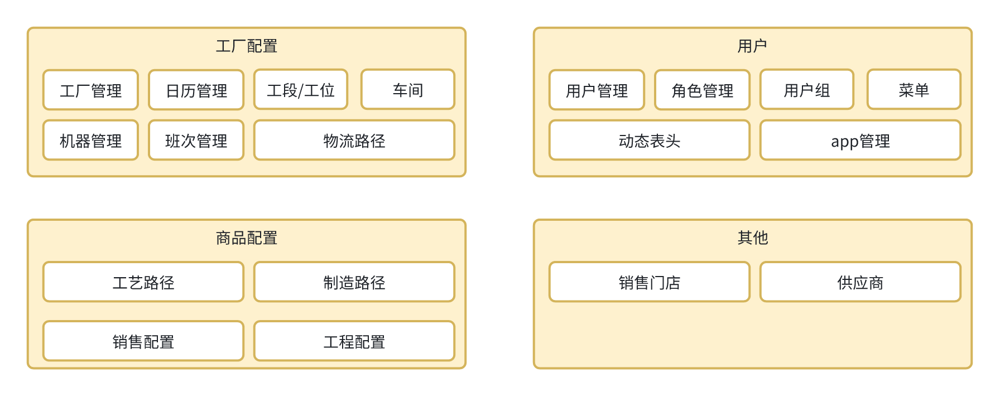

# peanut 门户组成部分

## base 基础配置组建

1. 任务配置
2. 任务引擎实现

## 模块功能如下：




# 项目说明

该模块可以单独启动， 也可以配合 peanut-portal增加多个模块一起启动。  
单APS启动为启动 com.olivia.BaseAPSBootstrapApplication

如需单独打包启动，增加spring-boot打包插件

```xml

<plugin>
    <artifactId>spring-boot-maven-plugin</artifactId>
    <configuration>
        <includeSystemScope>true</includeSystemScope>
    </configuration>
    <groupId>org.springframework.boot</groupId>
</plugin>

```

# 项目技术/文档
[项目文档/技术框架等](https://gitee.com/slsplatform/aps-end/blob/master/README.md)


# 版本变更历史

## 1.5.1
1. 修复BUG